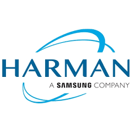

# About Me
As a Principal Engineer at Stellantis, I leverage my 16+ years of experience and MTech in Computer Science to design and develop cutting-edge solutions for the global leader in smart and sustainable mobility. I work with a cross-functional team of engineers, architects, and product managers to deliver high-quality software products and services that meet the needs and expectations of our customers and stakeholders.

My core competencies include Java, Python, Spring Boot, Microservices, Kafka, Mqtt, Rest API, Cloud technologies like AWS and Kubernetes, Mongo DB, Scylla DB, and MySQL. I have received multiple awards and recognition for driving excellence and innovation in projects such as Harman's Ignite Store and Ola Electric's Move OS 3 & 4 features. I am passionate about creating solutions that improve the lives of people and the planet through technology and engineering.

## Experience

### Stellantis
Principal Engineer
Dec 2023 - Present

### Ola Electric
Principal Engineer
Feb 2022 - Dec 2023 

### HARMAN International India Pvt. Ltd.
Principal Engineer
Feb 2015 - Feb 2022 

### Samsung India Software Operations
Tech Lead
Jul 2011 - Feb 2015 

### Wipro TechnologiesWipro Technologies
Senior software engineer
Jun 2010 - Jul 2011 

### Symphony ServicesSymphony Services
Software Engineer
Jul 2007 - Jun 2010 

